# Evaluating Language Models on Medical Question-Answering using DeepPhe Clinical Notes

_Author: Hung Tran / LAILab_
_Submission date:_

## Abstract

The purpose of this study is to evaluate the efficacy of various Large Language Models (LLMs) in interpreting and responding to medical questions derived from clinical notes. This evaluation was conducted using sample documents from the DeepPhe software, which provides clinical notes and their corresponding parsed information in JSON format.

The methodology involved constructing a set of user prompts for each clinical document. These prompts were created by combining a specific medical question with the content of the document. A standardized system prompt was also used to set the context for each LLM. These prompts were then fed to different LLMs through their APIs, and their responses were collected.

The responses from the LLMs were evaluated using two distinct methods: Natural Language Inference (NLI) model and Longest Common Subsequence (LCS) algorithm. The NLI models provided insights into how well the responses semantically and logically aligned with the answer keys, allowing for an evaluation of the responses' contextual accuracy even when paraphrased or presented differently. On the other hand, the LCS algorithms measured the degree of verbatim overlap between the LLM responses and the answer keys, emphasizing the precision of language, which is critical in medical documentation. This dual evaluation approach facilitated a comprehensive and nuanced comparison of the LLM responses against the pre-selected answer keys derived from the JSON data corresponding to each document.

In this study, I observed significant variations in the performance of different Large Language Models (LLMs) when evaluated using Natural Language Inference (NLI) models and Longest Common Subsequence (LCS) algorithms. Some LLMs demonstrated higher NLI scores, indicating a more robust capability in interpreting and responding to the context and nuances of medical questions, despite not always matching the exact wording of the answer keys. In contrast, other LLMs exhibited higher LCS scores, reflecting their tendency in replicating specific phrases and terminology from the answer keys but with a limited understanding of the underlying medical context or the complex inferences required by the questions.

In conclusion, this study highlights the potential and limitations of using LLMs for medical question-answering tasks. The results suggest that while some LLMs are quite adept at handling medical inquiries, there is a need for further refinement and training, specifically in the context of interpreting clinical notes and providing accurate, relevant responses. These insights could be of use in the advancement of AI applications in healthcare, especially in automating aspects of clinical documentation and decision support.

## Introduction

### Background

The advent of Large Language Models (LLMs) has revolutionized various fields, including healthcare. These models, leveraging vast amounts of data, have shown remarkable capabilities in understanding and generating human-like text. In the realm of medical question-answering, LLMs offer a promising tool for automating the interpretation of clinical notes and facilitating informed decision-making. However, the unique challenges posed by medical language, which include technical terms, patient-specific details, and the need for precise and accurate information, make it crucial to rigorously evaluate the efficacy of these models in a healthcare context.

### Objective

The primary objective of this study was to systematically assess the performance of various LLMs in interpreting and responding to questions derived from clinical notes. By employing sample documents from the DeepPhe software, which includes annotated clinical notes and their corresponding parsed information in JSON format, the study aimed to establish a testing scheme. This scheme involved constructing user prompts, comprising specific medical questions combined with clinical document content, and a standardized system prompt to set the context for each LLM. The responses from the LLMs were then critically evaluated using both Natural Language Inference (NLI) models and Longest Common Subsequence (LCS) algorithms. This dual approach aimed to gauge not only the factual accuracy of the responses but also their contextual and semantic alignment with the medical information presented in the documents. Ultimately, the study sought to uncover insights into the capabilities and limitations of LLMs in a medical setting, providing valuable information for their future development and application in healthcare.

## Methodology

### Sample Data

The study utilized clinical notes provided by DeepPhe, a software designed for detailed cancer phenotyping. These clinical notes encompass a range of patient encounters, treatments, and outcomes, typical of real-world clinical documentation. The accompanying JSON files, essential for this study, were generated by processing these clinical notes through the DeepPhe pipeline. This pipeline converts the unstructured text of clinical notes into structured data, capturing key medical information in a format conducive to computational analysis. These JSON files served two purposes: they provided a structured format of the unstructured clinical data and acted as a source for the answer keys used in evaluating the LLMs' responses.

### Testing Scheme Overview

The testing process is a multi-step procedure orchestrated through a main function, designed to load questions, answer keys, collect LLM responses, and then evaluate these responses. The steps were as follows:

1. **Loading Questions and Answer Keys**:

- The process began with loading the predefined set of medical questions from a `questions.json` file.
- Answer keys were then loaded for a specific patient (e.g., "fake_patient1"), which had been previously generated from the JSON data processed through the DeepPhe pipeline.

2. **Mapping Patients to Documents**:

- A mapping of patient names to their respective document names was established. This step was crucial to ensure that each patient's data was accurately paired with the corresponding clinical documents and their respective answer keys.

3. **Collecting LLM Responses**:

- For each patient and associated documents, LLM responses were collected. This involved iterating over each document and feeding the combined user and system prompts to various LLMs specified in `MODEL_LIST`. List of LLMs tested: GPT-4, Gemini 1.0, GPT-3.5 Turbo, Llama 2 70B, Llama 2 13B, Llama 2 7B, Vicuna-7B, Vicuna-13B, and Vicuna-33B.
  ```python
  MODEL_LIST = [
  	"gpt-4",
  	"gemini-pro",
  	"gpt-3.5-turbo-0613",
  	"llama-2-70b-chat",
  	"llama-2-13b-chat",
  	"llama-2-7b-chat",
  	"vicuna-7b-v1.5-16k",
  	"vicuna-13b-v1.5-16k",
  	"vicuna-33b-v1.3",
  ]
  ```
- The `collect_llm_responses` function was utilized to systematically gather responses from each LLM. This function integrated the model name, system prompt, user prompt template, patient name, document name, and the questions to fetch the LLM responses.

4. **Evaluating LLM Responses**:

- The collected responses were then evaluated against the answer keys for each patient and document.
- The `get_evaluation_results` function compared the LLM responses to the answer keys, applying the NLI and LCS methods to assess the semantic and literal alignment of the responses.

5. **Saving and Documenting Evaluations**:

- The evaluation results for each patient, document, and model were compiled into a structured format.
- These results were then saved into an `evaluation_results.json` file, providing a comprehensive record of the performance of each LLM across different patient cases and documents.

This detailed evaluation process ensured a thorough and systematic assessment of the LLMs' capabilities in interpreting and responding to medical queries. The methodical approach, from loading questions to documenting evaluations, allowed for a robust analysis, highlighting the strengths and weaknesses of each model in a structured and replicable manner.

## Details about Testing Scheme

### Testing Scheme

The testing scheme was meticulously crafted to evaluate the LLMs' proficiency in interpreting and responding to medical queries. The process involved:

1. **Extraction of Answer Keys from JSON Files**: Utilizing a custom function, answer keys were generated from the structured JSON data obtained through the DeepPhe pipeline. This function parsed the JSON file, extracting relevant information such as the patient’s name, document type, date, episode, document sections, mentions of anatomical entities, and their attributes. These answer keys were formatted to correspond directly with the questions in the user prompts, providing a structured and precise benchmark for evaluating the LLMs' responses. Below is a JSON file of the answer keys extracted from a DeepPhe JSON file:

   ```json
   {
     "name": "Fake Patient1",
     "type": "Radiology Report",
     "date": "January 23, 2010 at 10:45 AM",
     "episode": "Pre-diagnostic",
     "sections": "Clinical History, Procedure, Findings, Impression",
     "classUri-mentions": "Right_Axilla_Proper, Upper_inner_Quadrant, Right_Breast, Right_Axillary_Lymph_Node, Mass, Axillary_Lymph_Node, Right, Skin, Lymph_Node, Axilla, Nipple",
     "attributes": "Axilla: , Right: historic, Right_Breast: historic, Upper_inner_Quadrant: historic, Right_Breast: , Right_Breast: , Mass: historic, Nipple: , Skin: , Right_Axilla_Proper: historic, Right_Breast: , Right_Axillary_Lymph_Node: , Mass: historic, Right_Axilla_Proper: , Lymph_Node: historic, Lymph_Node: historic, Right_Breast: , Lymph_Node: , Right: historic, Skin: , Axillary_Lymph_Node: , Mass: historic"
   }
   ```

1. **Uniform System Prompt**: A standardized system prompt was employed to establish a consistent baseline for each LLM's response. This prompt instructed the LLMs to analyze the provided medical document and answer the subsequent question accurately, emphasizing the importance of adhering to the specified answer format. The prompt underscored the need for precision, conciseness, and direct reflection of the document's content in the responses, mirroring the precision required in real-world medical information processing.
   ```python
   SYSTEM_PROMPT = "Your task is to analyze the provided medical document and answer the following question accurately. Only answer with relevant information from the document and present your answer in the specified format. Pay close attention to the format requirements for the question to ensure your response align with the expected structure. Your goal is to provide a clear, concise, and correctly formatted answer based on the content of the document. Avoid extraneous details to ensure your answer is clear, concise, and correctly formatted, directly reflecting the document's content."
   ```
1. **Construction of User Prompts**: A structured set of medical questions was developed, each targeting a specific aspect of the clinical documents. The questions included inquiries about the patient's name, document type, principal date, stage of patient care, document sections, anatomical entities mentioned, and their described attributes. These questions were specifically formulated to cover a comprehensive range of information extracted from clinical notes. Each question, along with the corresponding clinical document, was then combined to form a user prompt.

   ```python
   USER_PROMPT_TEMPLATE = "{question}\n{document}"
   ```

   ```json
   {
     "name": "What is the patient's name as mentioned in the document?",
     "type": "What type of medical document is referenced in the text? Is it a 'Radiology Report', 'Surgical Pathology Report', 'Clinical Note', or is the type 'unknown' (unspecified)?",
     "date": "What is the principal date of the medical document as noted in the text, formatted as 'Month DD, YYYY at HH:MM'?",
     "episode": "Which stage of patient care does the document relate to? Is it 'Pre-diagnostic', 'Diagnostic', 'Medical Decision-making', or is this 'unknown' (not clearly indicated)?",
     "sections": "Analyze the body of the provided text and list out the main content sections or headings it contains, excluding any administrative or header information like 'Report ID,' 'Patient ID,' etc. Format your response as comma-separated values. For example, if the document includes sections such as 'History of Present Illness', 'Past Medical History', and 'Physical Exam', your response should be 'History of Present Illness, Past Medical History, Physical Exam'.",
     "classUri-mentions": "List each distinct anatomical entity mentioned in the document, in the order they appear. Format your response as comma-separated values, using underscores to connect multiple words in a single entity, similar to 'Axilla, Right_Breast, Upper_inner_Quadrant'.",
     "attributes": "Identify and list attributes (negated, uncertain, generic, conditional, historic, temporality) for each anatomical entity mentioned in the document, as they are described in the document. Format your response by pairing each entity with its attributes, like 'Right: historic, Right_Breast: historic', separated by commas."
   }
   ```

1. **Evaluation Process Overview**:
   - **Feeding Prompts to LLMs**: The combined user and system prompts were fed to each LLM. This ensured a uniform testing environment, allowing for fair comparisons across different models.
   - **Collecting LLM Responses**: Responses from the LLMs were gathered systematically, maintaining the integrity and originality of each response.
   - **Assessing Responses with NLI and LCS**: The LLM responses were then evaluated using two methods. Natural Language Inference (NLI) models assessed the semantic and logical alignment of the responses with the answer keys, emphasizing contextual understanding. The Longest Common Subsequence (LCS) algorithm quantified the verbatim accuracy of the responses, focusing on the exactness of the language used. This dual evaluation method offered a comprehensive view of each LLM's performance, highlighting both their understanding of medical context and precision in response formulation.

This testing scheme, encompassing user prompt construction, answer key generation, a uniform system prompt, and a dual-method evaluation process, provided a thorough framework for assessing the LLMs. It allowed for an in-depth analysis of their capabilities in processing detailed medical information, crucial for applications in healthcare.

### Evaluation Metrics

#### NLI Score

The NLI score is calculated by a Cross-Encoder, which is a transformer model that takes in two sentences as a pair of premise-hypothesis and outputs logits for 3 labels: `"contradiction"`, `"entailment"`, and `"neutral"`. Here I use the model named `"cross-encoder/nli-deberta-base"` loaded from Hugging Face. Here, the answer key is the premise and the LLM's response is the hypothesis. The answer-response pair is passed to the model to predict the score of the three labels in the range of 0 to 1 by applying the softmax function on the output logits. The score for `"entailment"` is used to represent the NLI score.

#### LCS Score

The LCS score is computed using the `pylcs` Python library. Both the LLM's response and the answer key are first normalized by converting all characters to lowercase, replacing all whitespace with spaces, and normalizing Unicode characters. The LCS algorithm then counts the matching characters in these normalized strings. This count is divided by the total number of characters in the answer key to yield a value between 0 and 1. This value is used to represent the LCS score.

## Results

After collecting responses of 9 models over 59 documents, the evaluation results are ready.

### Data Representation

This bar graph shows the average NLI and LCS scores of tested models on all question types. Despite very high LCS scores, the NLI scores of the models are low, mostly less than 0.5. Among the models, `gemini-pro` exhibits the highest average NLI score, contrasting with its lowest average LCS score. Models like `gpt-4` and `gpt-3.5-turbo-0613` exhibit marginally lower NLI scores than `llama2-70b-chat` or `llama-2-7b-chat`. All models demonstrate high LCS scores, mostly ranging from 0.7 to 0.8, except for `gemini-pro` with a LCS score of 0.6.

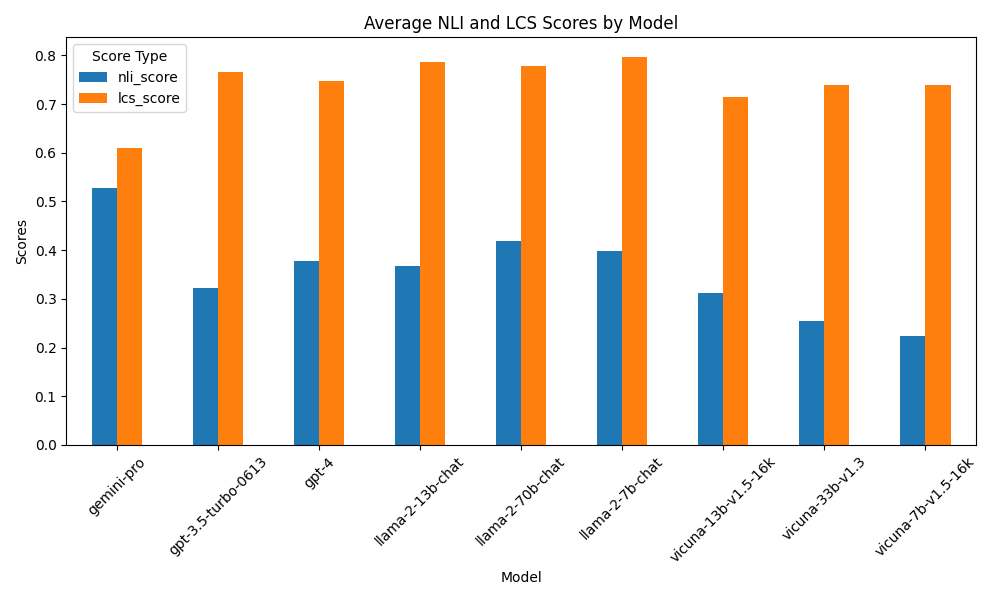

This bar graph shows the models' average NLI and LCS scores on each question type. Most question types see a huge difference between the NLI score and LCS score, except `attributes` and `classUri-mentions`. Models have exceptionally low LCS scores on `attributes` and `classUri-mentions` compared to other question types. Except `type`, the models have very low NLI scores on all other question types, with `date`, `type`, and `episode` being the lowest.

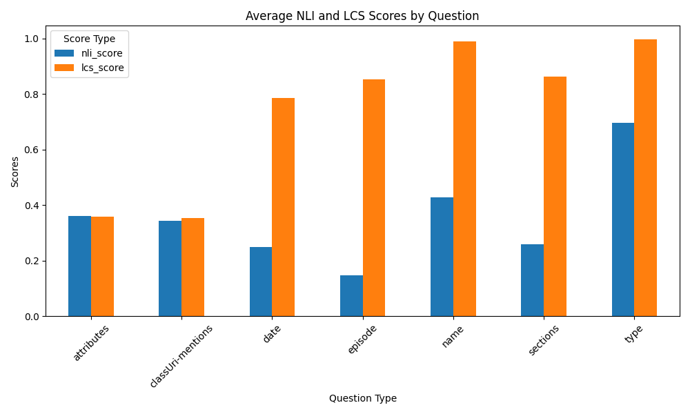

Here are the box plots for the distributions of all tested models' NLI scores and LCS scores. All models see a substantial variation in performance, with more variation in the NLI score. All models have LCS scores higher than 0.5.

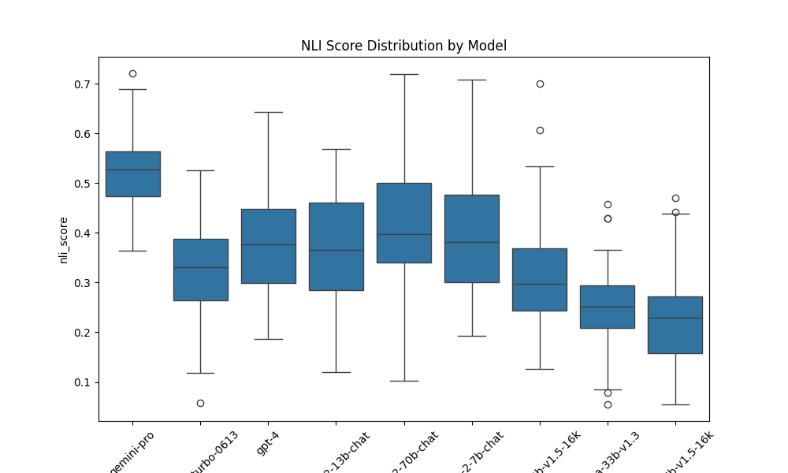
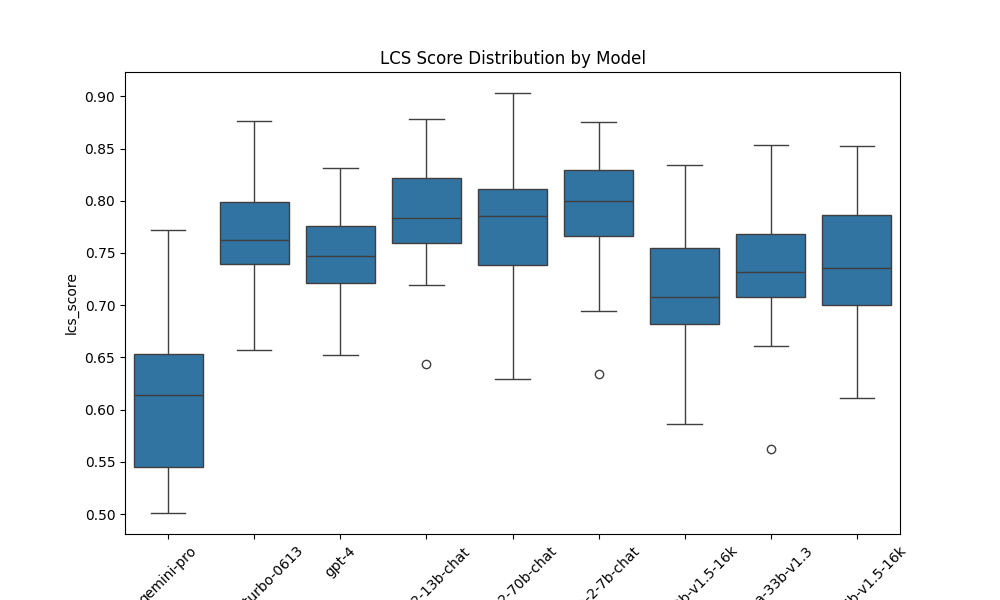

## Discussion

### Interpretation

- **Despite all having very high LCS scores, the models' NLI scores are low:** The consistent achievement of high LCS scores across models signifies a robust ability to replicate important key words or phrases from the source material. However, the lower NLI scores suggest that their capacity to comprehend and infer semantic meaning from the text is less consistent. We will go through this point in details later.

- **`gemini-pro` has the highest average NLI score but also has the lowest average LCS score:** This indicates that while its responses closely agrees with the answer keys in content or semantics (or both), the model might have formatted the response differently from the answer key in some question types or it just did not capture enough information from the documents, which led to low LCS scores. Further investigation into the data revealed that there are several factors:

  - All of the model's responses are very concise, with only information needed from the question. This helped increase the average NLI score of the model.
  - The model's responses to certain question type are not in the format specified by the question, making the average LCS score low.

- **Models like `gpt-4` and `gpt-3.5-turbo-0613` exhibit marginally lower NLI scores than `llama2-70b-chat` or `llama-2-7b-chat`:** While models like GPT-4 and GPT-3.5 were expected to show a more pronounced performance advantage, their scores fall marginally below those of the Llama 2 models. This suggests a potential for the Llama 2 models to be able to replace models like GPT 4 and GPT 3.5 in certain tasks.

- **`attributes` and `classUri-mentions` have low LCS and NLI scores compared to other question types:** The lower scores in `attributes` and `classUri-mentions` question types across both NLI and LCS metrics indicate a common difficulty among models in handling these types of questions. This may be due to the complex nature of medical terminologies and the specific contextual knowledge required to accurately map these attributes and mentions, which are often less about recall and more about understanding intricate relationships or states described in the text.
- **`type` has the highest average NLI score and LCS score:** High scores in the `type` category indicate strong performance by models in identifying the general purpose/topic of a document.
- **`date`, `sections`, and `episode` have the lowest NLI scores:** Analysis of responses shows that while models provided accurate information for questions like `date`, `sections`, and `episode`, their tendency to include additional reasoning explanations, exceeding the prompt specifications, impacted their NLI scores. Limited context window length appears to be the bottleneck, as smaller models veer into extraneous reasoning compared to larger models' adherence to prompt format and conciseness.

### Limitations

The methodology employed in the present study to assess the performance of various language models (LMs) in the domain of medical question-answering, while meticulous, is subject to several limitations that must be acknowledged.

Firstly, the reliability of DeepPhe-generated JSON files as a source of ground truth is not absolute. The inherent inaccuracies within these files mean that any derived statistics regarding model performance may not wholly represent the models' true capabilities in understanding and responding to medical queries. Consequently, the benchmark against which model responses are evaluated may itself be flawed, potentially skewing the performance evaluation.

Regarding the metrics used for evaluation, the NLI score, despite being a valuable tool for gauging semantic understanding, is not infallible. An NLI model assigns high entailment scores to responses that include verbatim or paraphrased information from the premise. However, it may unduly penalize responses that incorporate medically relevant information not explicitly present in the premise, thereby not fully capturing the accuracy of a model's response.

Similarly, the LCS score, which measures textual overlap, has its own set of constraints. A response may achieve a high LCS score by echoing the language of the answer key, yet still fail to convey the correct medical information or answer the question appropriately. This metric does not account for the semantic correctness or clinical relevance of the response, which is especially crucial in the medical field.

The structure of the input provided to the models—comprising the system prompt, question, and document—can also influence their performance. Variations in the ordering of these elements may yield different results among models, suggesting that the format of the input can impact the comparability of the models' performance. For example, placing the system prompt at the last may make the models more attentive to its requirements about the response format.

Finally, it is important to recognize the inherent variability in the models' outputs. Language models may generate different responses upon subsequent prompts, leading to variations in LCS and NLI scores. This stochastic nature of language models introduces an element of unpredictability in their performance assessment and underscores the need for multiple trials to accurately gauge their consistency and reliability.

## Conclusion

This investigation into the efficacy of Large Language Models (LLMs) within the realm of medical question-answering has yielded enlightening results, revealing both the potential and the challenges associated with their deployment. Key findings indicate that while LLMs exhibit a strong capability for textual matching, as evidenced by the uniformly high LCS scores, their performance in semantic inference, as measured by NLI scores, presents a more heterogeneous picture. This variance underscores the complexity of medical language and the nuanced understanding required to accurately interpret and respond to medical queries.

#### Key Findings:

- **High accuracy in general knowledge questions:** LLMs achieve impressive performance on questions requiring simple factual recall, demonstrating their capacity for knowledge integration.
- **Mixed performance in medical reasoning:** While some LLMs perform well on tasks requiring basic medical reasoning, others struggle with complex concepts and intricate relationships.
- **Inconsistency in answer formatting:** Formatting inconsistencies lead to lower NLI scores for certain models, highlighting the need for stricter adherence to prompt specifications in medical contexts.
- **Limited context handling:** Smaller models tend to veer into unnecessary justifications, exceeding context limitations and impacting NLI scores.

#### Implications for using LLMs in medical Q&A:

- **Supportive tool, not replacement:** LLMs can be valuable assistants for healthcare professionals, offering quick retrieval of factual information and supporting preliminary reasoning. However, their limitations require human oversight and careful evaluation of responses.
- **Emphasis on model selection and adaptation:** Choosing LLMs trained on medical data and optimized for reasoning tasks is crucial. Additionally, adaptation to specific question formats and context constraints is essential to improve accuracy and reliability.
- **Clear instructions and concise prompts:** Formulating clear questions with concise prompts is essential for maximizing LLM performance and minimizing irrelevant output.

#### Future Research Directions:

- **Improved medical reasoning capabilities:** Develop LLMs with deeper understanding of medical concepts and the ability to handle complex relationships and reasoning tasks through fine-tuning with extensive, high-quality medical datasets and other techniques.
- **Context-aware adaptation:** Explore prompting techniques for LLMs to dynamically adjust their responses based on the provided context and question format. This can help enforce consistent response formatting by LLMs, facilitating easier parsing and information extraction from the model outputs.
- **Robust Error Analysis**: Systematically identify and analyze errors to inform targeted improvements in LLM training and architecture.
- **Evaluation metrics beyond NLI:** Develop a broader set of metrics specific to medical Q&A tasks, taking into account reasoning accuracy, answer clarity, and adherence to ethical considerations.

By addressing these challenges and exploring future research directions, LLMs can evolve into truly valuable tools for healthcare professionals, improving medical knowledge access and supporting informed decision-making.

## Appendix

Here are the bar graphs display the average NLI and LCS scores by question types for all models:
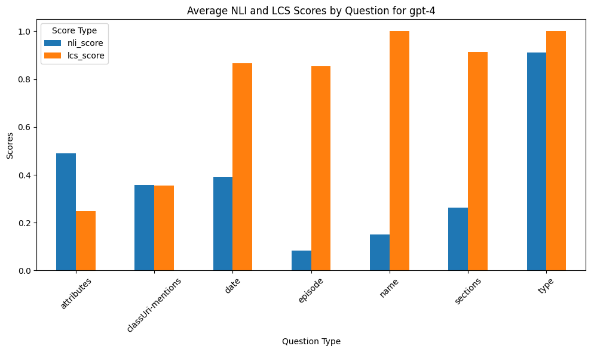
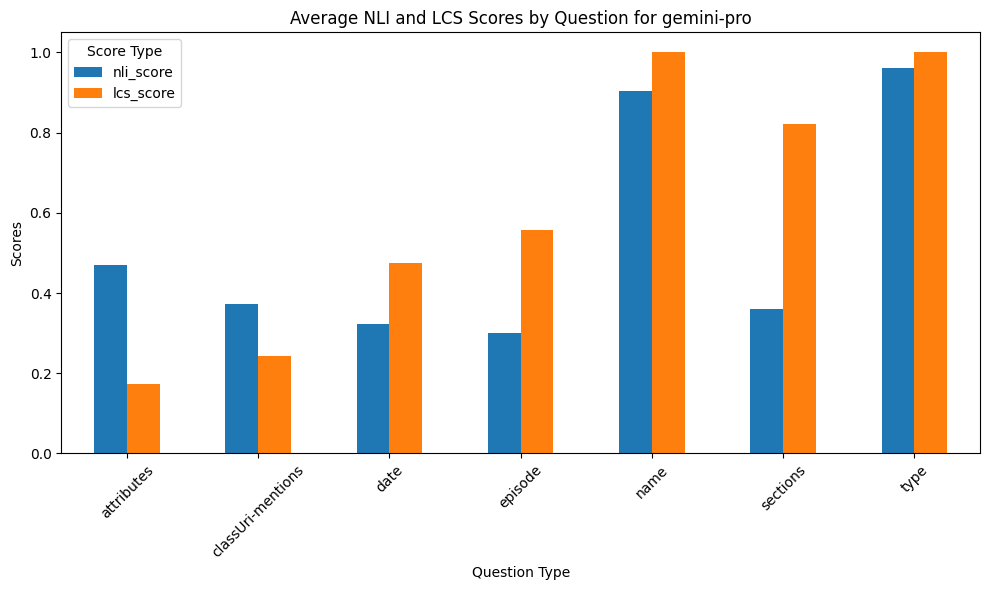
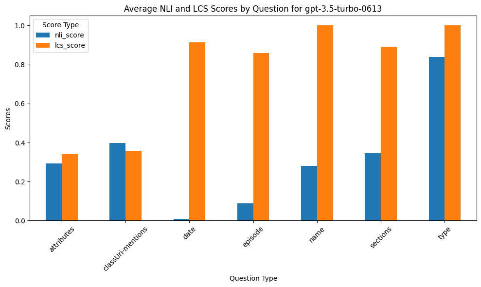
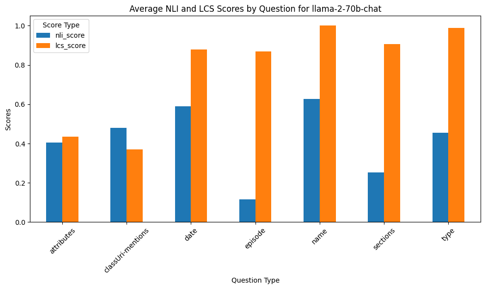
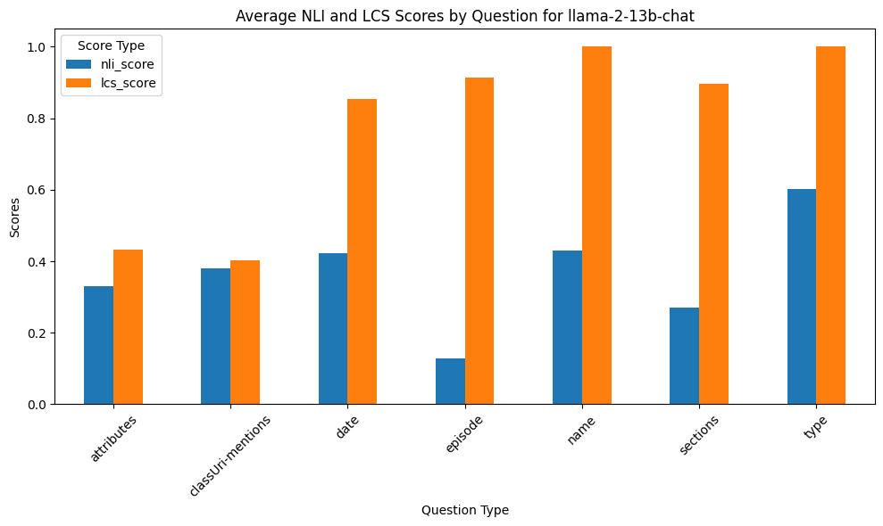
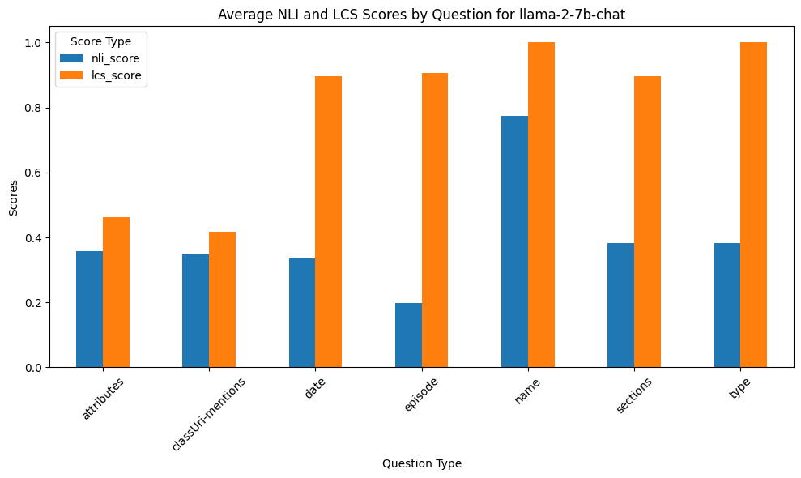
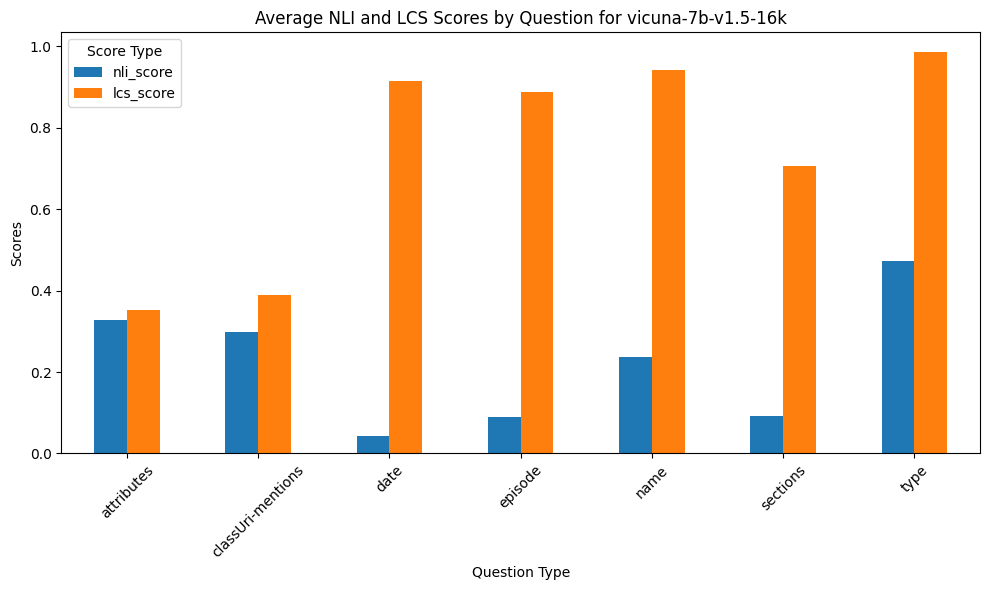
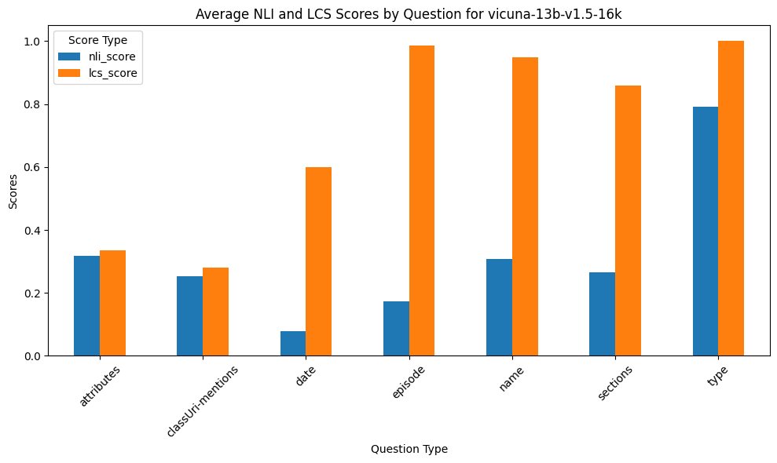
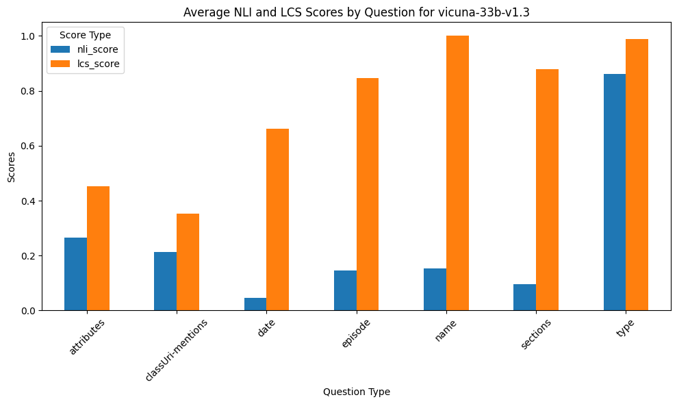
Notably, the `name` and `type` question types have the highest NLI scores among other models.
As seen in the bar graphs, the model's LCS scores on the `date` and `episode` question types a the lowest among other models.
Further investigations revealed that the model has very low LCS scores in the `date` and `episode` question types compared to other models, because of two factors:

- It responded very concisely. In fact, `gemini-pro` is the only model that obeyed the system prompt, responding concisely with only the required information, unlike other models with responses of full sentences/paragraphs.
- Most of its responses for the `date` question type are in the wrong format, which made little room for verbatim overlap with the answer key strings.

## References

- Savova, G. K., Tseytlin, E., Finan, S., Castine, M., Miller, T., Medvedeva, O., ... & Jacobson, R. S. (2017). DeepPhe: a natural language processing system for extracting cancer phenotypes from clinical records. *Cancer research*, *77*(21), e115-e118.
- OpenAI (2023). GPT-4 Technical Report. *arXiv preprint arXiv:2303.08774*.
- Brown, T., Mann, B., Ryder, N., Subbiah, M., Kaplan, J. D., Dhariwal, P., ... & Amodei, D. (2020). Language models are few-shot learners. *Advances in neural information processing systems*, *33*, 1877-1901.
- Team, G., Anil, R., Borgeaud, S., Wu, Y., Alayrac, J. B., Yu, J., ... & Ahn, J. (2023). Gemini: a family of highly capable multimodal models. *arXiv preprint arXiv:2312.11805*.
- Touvron, H., Martin, L., Stone, K., Albert, P., Almahairi, A., Babaei, Y., ... & Scialom, T. (2023). Llama 2: Open foundation and fine-tuned chat models. *arXiv preprint arXiv:2307.09288*.
- Chiang, W. L., Li, Z., Lin, Z., Sheng, Y., Wu, Z., Zhang, H., ... & Xing, E. P. (2023). Vicuna: An open-source chatbot impressing gpt-4 with 90%\* chatgpt quality. *See https://vicuna. lmsys. org (accessed 14 April 2023)*.
- He, P., Liu, X., Gao, J., & Chen, W. (2020). Deberta: Decoding-enhanced bert with disentangled attention. *arXiv preprint arXiv:2006.03654*.
- Bergroth, L., Hakonen, H., & Raita, T. (2000, September). A survey of longest common subsequence algorithms. In *Proceedings Seventh International Symposium on String Processing and Information Retrieval. SPIRE 2000* (pp. 39-48). IEEE.
